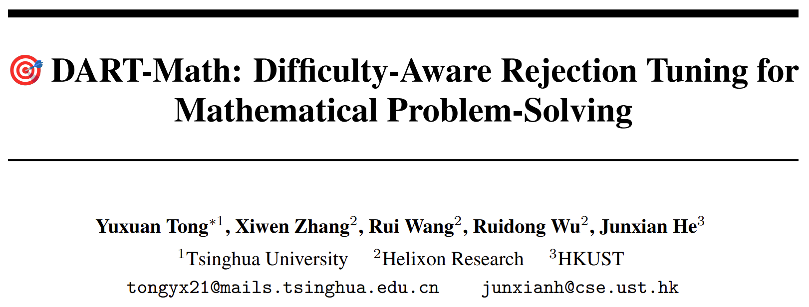
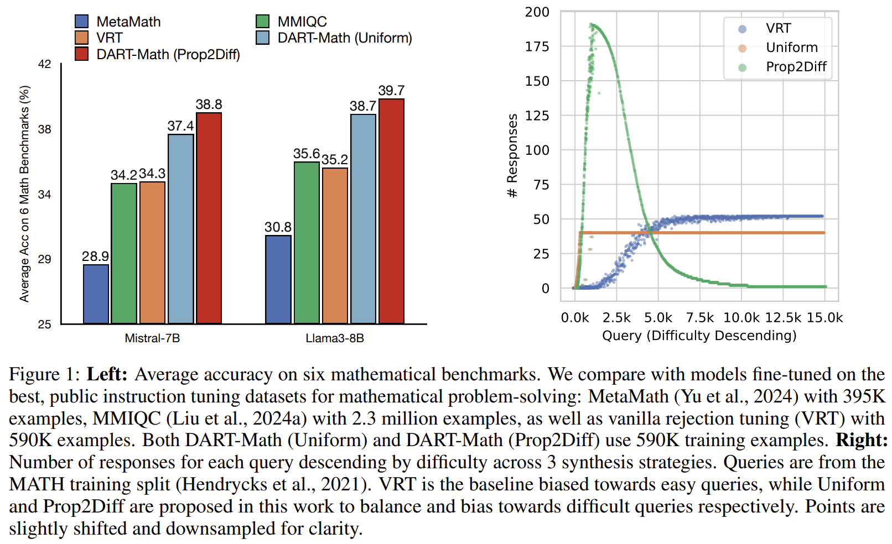
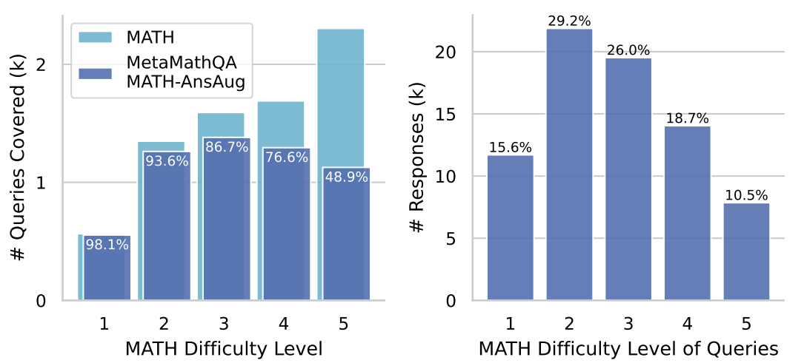
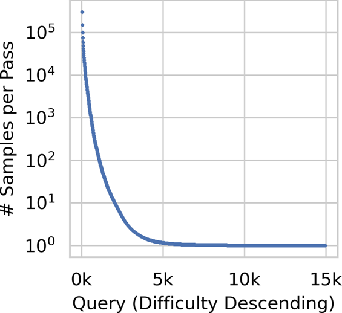
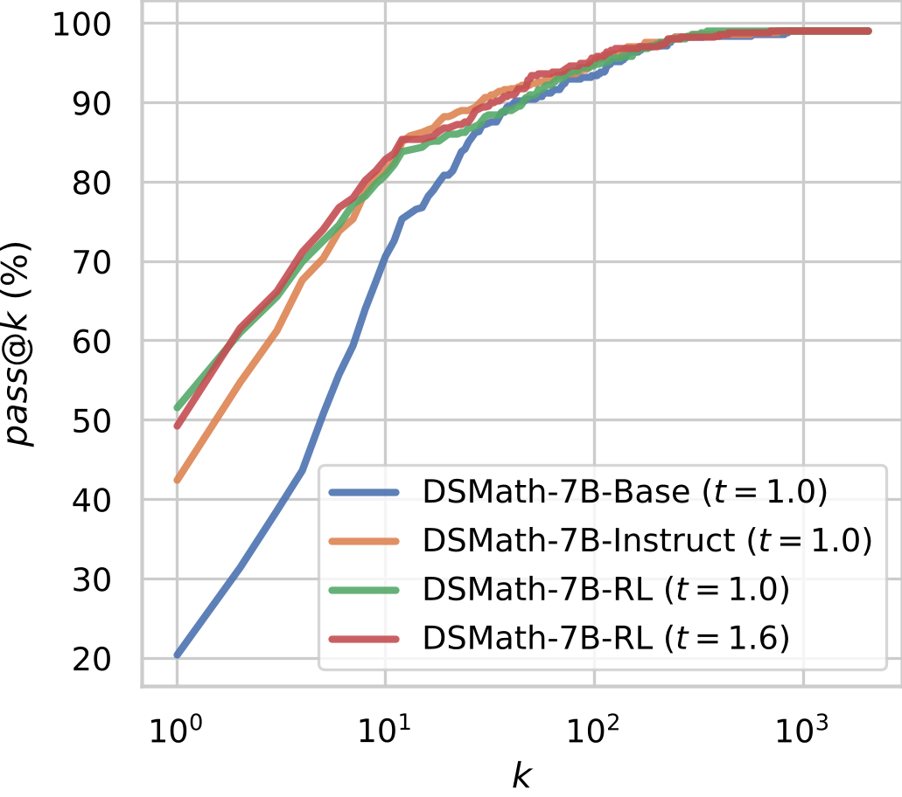
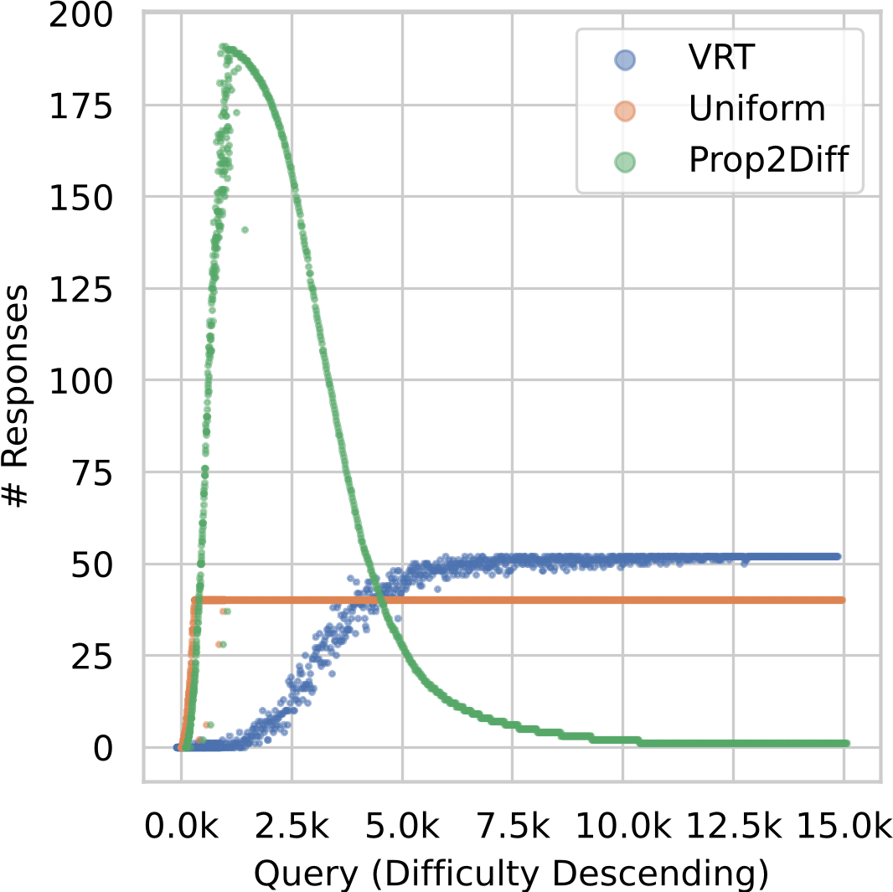
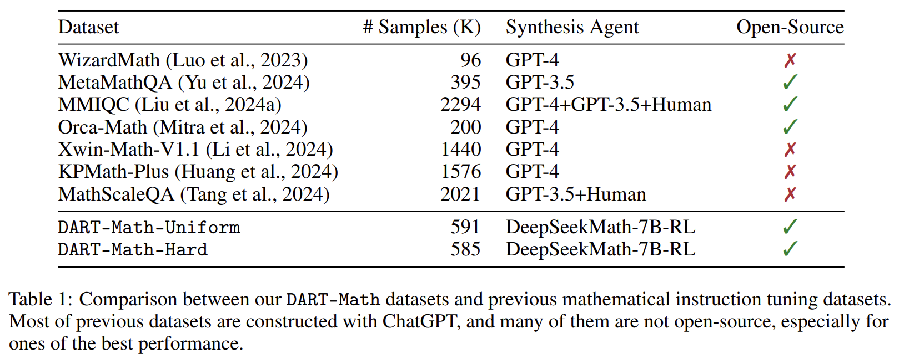
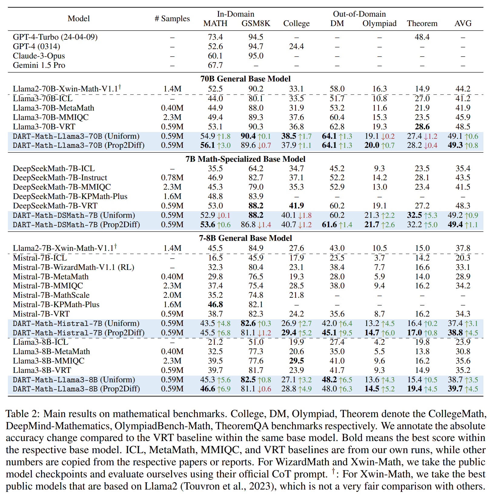
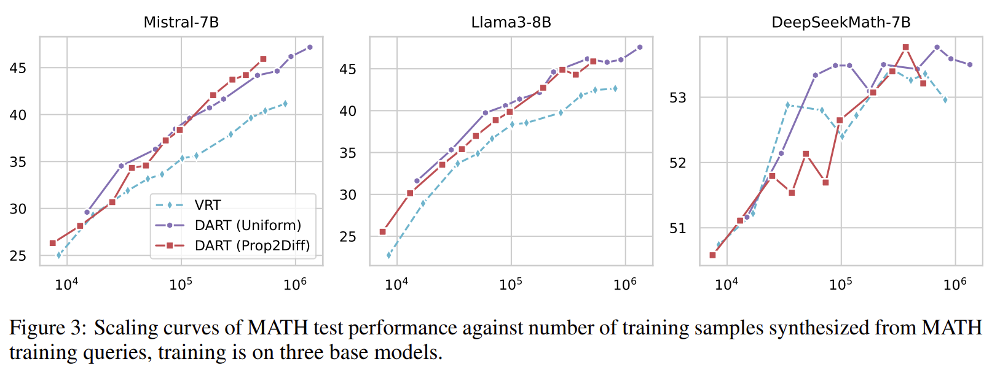

# 现有数据集普遍存在偏差？DART-Math：使用难度感知拒绝调优（Difficulty-Aware Rejecting Tuning）增强数学问题求解

📝 [论文@GitHub](https://tongyx361.github.io/assets/dart-math/paper-dart-math.pdf) | 🤗 [数据&amp;模型@HF](https://huggingface.co/collections/hkust-nlp/dart-math-665704599b35de59f8fdf6c1) | 🐱 [代码@GitHub](https://github.com/hkust-nlp/dart-math) | 🐦 [Thread@X(Twitter)](https://x.com/tongyx361/status/1811413243350454455)

**TL;DR:** 现有的用于数学推理指令微调的合成数据集普遍**偏向于简单查询**，难度感知拒绝调优（Difficulty-Aware Rejecting Tuning，`DART`）通过**为困难查询分配更多数据合成资源**，消除了这一偏向，并取得了**显著提升**。

**Takeaways:**

- 现有最先进的数学指令微调数据集（例如 MetaMath）普遍**偏向于简单查询**，且对于最困难的查询经常出现没有任何响应样本的情况。
- 对于简单查询的偏向主要来源于它们使用的**原始拒绝采样（Vanilla Rejection Sampling）** 方法，其对每个查询采样**相同数量**的原始响应，并过滤以仅保留正确响应，但为困难查询采样正确响应的概率显著更低，有时接近于 0。
- **小规模的开源模型就能对绝大部分查询合成正确响应。** 例如，DeepSeekMath-7B 系列模型，在 MATH500 上，对于 >90% 的查询，都能在 100 次尝试内至少正确回答一次；对于>99% 的查询，都能在 1000 次尝试内至少正确回答一次。
- **难度感知拒绝调优 （Difficulty-Aware Rejecting Tuning，`DART`）** 通过对困难查询进行更多的采样，合成更重视困难查询的数据集，与 原始拒绝调优（Vanalla Rejection Tuning, VRT） 相比，在 4 个预训练模型上与 6 个数学问题求解评测基准上一致取得了显著提升。
- **不依赖于 GPT-4 等专有模型**合成的 **`DART-Math` 数据集**是目前数学问题求解任务上**最有效且最具性价比的公开指令调优数据集**，在其上训练的 **`DART-Math` 模型**在多个**领域内与领域外**数学问题求解评测基准上实现了 **SOTA**。

# 🎯DART-Math: Difficulty-Aware Rejection Tuning for Mathematical Problem-Solving

近年来，通过使用大型语言模型（Large Language Models，LLMs），各种任务取得了显著进展。然而，这些模型仍然在复杂推理方面存在困难，这是人类认知的基石，对于解决复杂任务至关重要。其中，**数学推理**非常具有代表性，是当前 LLMs 最困难的推理类别之一。在提升预训练 LLMs 数学推理能力的方法中，**指令调优（Instruction Tuning）** 被认为最具性价比，并在各种数学基准上实现了 SOTA 性能。

我们发现，现有的数学指令微调数据集普遍**严重偏向于简单查询（query）**，且**对于最困难的查询，经常没有任何响应（response）样本**。

为了解决这一问题，我们提出了 **难度感知拒绝调优 （Difficulty-Aware Rejecting Tuning，DART）**，其通过对困难查询进行更多的采样，合成与已有方法相比更重视困难查询的数据集。

基于 DART，我们合成了 `DART-Math` 系列数据集，并基于四个预训练模型在这些数据集上进行指令微调，得到了 **`DART-Math` 系列模型**，相比已有的最先进的方法（MetaMath & MMIQC）与原始拒绝调优（Vanilla Rejection Tuning, VRT）基线，取得了显著提升（图 1 左），并**在多个 in-domain 与 out-of-domain 数学评测基准上实现了 SOTA**。

**`DART-Math` 系列数据集**消除了对于简单查询的偏向（图 1 右），并被实验验证为目前数学问题求解任务上**最有效且最具性价比的公开指令调优数据集**。

## 观察：现有合成数据集普遍偏向于简单查询

目前用于数学问题解决的最先进的指令调优方法通常实现为：通过从专有模型（如 GPT-4）生成的**合成数据**来扩充现有的训练数据集。一种常见的数据合成/增强方法是从模型中对给定查询采样多个响应并过滤得到正确相应，这种方法属于**拒绝采样（Rejection Sampling）**；在拒绝采样得到的数据上训练模型，被称为**拒绝调优（Rejection Tuning）**。它们通常可以产生带有高质量推理步骤的样本，并实现可观的性能。

然而，经过对 MetaMathQA 等最先进的合成数据集的仔细检查，我们发现它们**严重偏向对简单查询的响应**，且**对困难查询的覆盖率较低**。例如， MetaMathQA-MATH-AnsAug 数据集中，对于原始 MATH 训练集中占 30.7% 的最困难（5 级）的查询，有 51.1％ 没有任何对应响应（图 2 左），且对应响应仅占所有样本的 10.5%（图 2 中）。

## 归因：原始拒绝调优（Vanilla Rejection Tuning，VRT）

对于简单查询的偏向现象普遍存在于先前基于拒绝采样的数据合成方法中。我们经过分析，发现这主要是因为现有方法的拒绝采样通常对每个查询采样**相同数量**的原始响应，而对于困难查询采样得到正确响应的概率显著更低，有时接近于 0（见下图），导致困难查询处于劣势地位。我们将这种方法称为**原始拒绝采样（Vanilla Rejection Sampling，VRS）**，在对应数据上训练称为**原始拒绝微调（Vanilla Rejection Tuning，VRT）**。

## 支持：开源模型就能为最困难的查询生成正确响应

我们猜测**对于简单查询的偏向会阻碍模型学习数学问题求解**，因为困难样本通常被认为对模型学习更为关键。因此，我们希望通过为困难 query 收集足够多样本。

但考虑到尽管进行了大量采样，模型仍可能无法为具有挑战性的查询生成正确的响应，为了评估上述目标能否实现，我们探索了 **DeepSeekMath-7B 模型**的能力，这是一系列专门针对数学推理训练的强大模型。

图 2（右）展示了 **MATH500** 中查询的 pass@k 准确率，DeepSeekMath-7B 系列模型，在 MATH500 上，**对于 >90% 的查询，都能在 100 次尝试内至少正确回答一次；对于>99% 的查询，都能在 1000 次尝试内至少正确回答一次**。

这表明，**较强的开放权重模型已经能够为绝大多数查询生成正确响应**，验证了通过精心设计的采样策略来有效缓解对于困难查询的相应不足这一问题的潜力。

## 方法： 难度感知拒绝调优 （Difficulty-Aware Rejecting Tuning，DART）

我们提出了 **难度感知拒绝调优 （Difficulty-Aware Rejecting Tuning，`DART`）**，其通过对困难查询进行更多的采样，合成与已有方法相比更重视困难查询的数据集。

### 两种策略：均匀（Uniform） & 正比于难度（Prop2Diff）

具体来说，我们开发了两种**难度感知拒绝采样 （Difficulty-Aware Rejecting Sampling，`DARS`）** 策略来实现上述目标：

1. **Uniform**：为每个查询采样直到该查询积累了**固定数量 $k_{u}$** 的正确响应；
2. **Prop2Diff**：为每个查询采样直到该查询积累了**与其难度分数成正比**的正确相应，其中最困难的查询拥有 $k_{p}$ 个正确相应；其刻意使数据偏向于困难查询，与 VRS 相反。

$k_{u}$ 与 $k_{p}$ 都是预先设定的超参数，决定了数据集的规模。

### 难度评估的替代指标：失败率（fail rate）

Prop2Diff 策略涉及到对查询难度的评估，我们引入了**失败率（fail rate）**——在对给定查询进行 nd 次响应采样时，不正确响应的比例——作为难度的替代指标。这个指标符合如下直觉，即更难的查询往往更少产生正确的响应。具体来说，我们利用 DeepSeekMath-7B-RL 作为采样模型，并且在论文中的所有实验中如此评估难度。

值得注意的是，失败率的一个好处是它**允许复用在难度评估过程中采样的响应来构建合成数据集**。

### 对比：三种与难度相关的拒绝采样与调优策略

加上 VRT，3 种不同的策略产生的相同规模数据集被总结在图 1（右）中。

## 结果：`DART-Math` 是数学问题求解任务上 SOTA 且数据高效的开源数据集与模型

我们将 `DARS` 应用于较为困难的 MATH 与较为基础的 GSM8K 两个数据集的训练集，合成了**两个数据集，分别对应 Uniform 和 Prop2Diff 策略，均包含约 590K 个示例，称为 `DART-Math`**。值得注意的是，虽然以前的工作大多利用 GPT-4 来合成数据，但我们只依赖于 DeepSeekMath-7B-RL 模型来合成所有数据，从而**消除了对专有模型的依赖**。

表 1 对比了 **`DART-Math` 数据集与先前的数学指令调优数据集**。大多数先前的数据集都基于 ChatGPT 构造，且许多都**没有开源**，尤其是表现最佳的数据集。

为了验证 `DART-Math` 的有效性，我们进行了广泛的实验，涉及到：

**4 个基础预训练模型：**

- 通用模型：1）Mistral-7B，2）Llama3-8B ，3）Llama3-70B；
- 数学专用模型：4）DeepSeekMath-7B。

**6 组评测基准：**

- 领域内：1）MATH，2）GSM8K；
- 领域外：3）CollegeMath，4）DeepMind Mathematics，5）OlympiadBench-Math，6）TheoremQA。

**5 种基线：**

- 先前工作：1）MetaMath，2）MMIQC，3）KPMah-Plus，4）Xwin-Math；
- 方法对比：5）VRT。

表 2 总结了主要的实验结果：在 2 个领域内和 4 个具有挑战性的领域外评测基准中，`DART-Math` **明显优于** VRT 和先前最先进的公共数据集上的基线，且通常可以通过**更少的训练数据**来实现。

与 **Vanilla Rejection Tuning 基线**相比：`DART-Math` 在绝大多数情况下一致超越了 VRT 基线。

- 对于 **7-8B 的通用基础模型**，具有代表性的 `DART-Math-Llama3-8B` (Uniform) 在所有 6 个评测基准中一致超过 VRT 基线，平均提高 3.5 个绝对点，而 `DART-Math-Llama3-8B` (Prop2Diff) 平均提高 4.5 个绝对点。
- 在富有挑战性的领域外评测基准中，`DART-Math` (Prop2Diff) 模型的**泛化增益尤其显著**，在 CollegeMath、DeepMind Mathematics 和 OlympiadBench-Math 上的提升幅度从 5.2 到 9.5 个绝对点不等。
- `DART-Math` 并未在相对简单的领域内 GSM8K 评测基准取得显著提升；这是符合预期的，因为**在简单任务上 VRT 不会像在困难任务上一样导致严重的偏差**。
- 有趣的是，在更强大的基础模型 DeepSeekMath-7B 和 Llama3-70B 上，`DART-Math` 相对 VRT 的改进幅度减小，平均约为 1 个点；我们推测这是由于这些模型**在数学内容上进行了广泛的预训练**，这种预训练可能涵盖了大部分可能从 GSM8K 和 MATH 训练查询中学到的技能，这意味着**查询集本身，而不是响应，成为了瓶颈**。因此，扩充查询范围可能是未来改进的更有效策略。

与**先前最先进的基线**相比：`DART-Math` 取得了**更好或具备竞争力**的性能。

- 与 **MetaMath** 相比，`DART-Math` 在所有情况下都取得了显著提升。
- 在**挑战性评测基准**如 MATH、OlympiadBench-Math 和 TheoremQA 上，`DART-Math-DSMath-7B` 实现了 **7-8B 规模模型的 SOTA**。
- 即使只使用了 **约 1/4 的训练样本**，`DART-Math-Mistral-7B` (Prop2Diff) 也比 Mistral-7B-MMIQC 平均提高了 4.6 个绝对点。
- 与**依赖于 GPT-4 但尚未发布数据或模型的同期工作** 相比：
  - 相对于 KPMath-Plus，`DART-Math` 在 Mistral-7B 和 GSM8K 、MATH 上略微表现不佳，但在 DeepSeekMath-7B 上的表现显著更优，且只使用了约 1/3 的训练样本。
  - 相对于 Xwin-Math，`DART-Math` (Prop2Diff) 在 GSM8K 评测基准上表现略差，但在其他挑战性评测基准上显著更优，尤其是在 70B 模型上差距更加明显，且只使用了约 1/3 的训练样本。（尽管我们注意到，Xwin-Math 的模型基于 Llama2，该比较并不完全公平）

重要的是，我们**完全开源**了数据集和模型，使 `DART-Math-Uniform` 和 `DART-Math-Hard` 成为了**数学问题求解任务中表现最佳、性价比最高的公开指令调整数据集**。

## 分析

### 不同数据合成方法的扩展（Scaling）行为

我们研究了 `DARS` 的扩展行为，并将其与 VRS 进行了比较。由于对简单查询的偏向仅在具有挑战性的数据集中显著，因此，在扩展实验中，我们仅为具有挑战性的 MATH 数据集的训练查询合成响应，并报告在 MATH 测试集上的性能。

图 3 展示了在将训练数据大小从数千个样本增加到近 100 万个样本时，三种不同基础模型的结果。我们观察到，

- 随着训练数据大小呈指数增长，性能稳步提高。
- `DART` 在通用基础模型 Mistral-7B 和 Llama3-8B 上始终优于 VRT，实现了更好的扩展。
- 然而，在 DeepSeekMath-7B 上，各种方法之间的性能差异很小。DeepSeekMath-7B 仅使用数千个训练样本就已经达到了超过 50% 的准确率，将样本扩展到 100 万个只会导致 3 个点的轻微提升。这与 Mistral-7B 和 Llama3-8B 等其他模型上看到的超过 20 个点的提升形成了鲜明对比。正如前文讨论的那样，我们认为这种现象是由于 MATH 训练查询对 DeepSeekMath-7B 并不特别有益，后者已经经历了广泛的数学特定持续预训练。因此，对于 DeepSeekMath-7B，这些方法之间的差异并不显著，主要瓶颈可能转移到了查询覆盖范围而不是响应本身。

### 单个响应覆盖的影响

`DARS-Prop2Diff` 在训练样本数量较少时容易导致在简单查询完全没有合成响应，为此，我们**确保了简单查询实际上至少有一个响应样本**。为了确认这一设计的影响，我们在不同规模的训练数据上比较了具有和没有此覆盖约束的 `Prop2Diff` 策略。

图 4（左）分别展示了在 MATH 和 GSM8K 评测基准上的结果。

对于 Prop2Diff，当训练数据大小相对较小时，单个响应覆盖证明是有益的，特别是在较简单的 GSM8K 评测基准中，将准确率提高了约 8 个点，这表明，**仅凭一个额外的正确响应就可以实现对简单问题解决的有效学习**；随着训练数据大小的扩大，对于简单查询覆盖率的自然增加导致了两种方法之间的差异减小。

此外，我们探讨了**在 VRT 中补充单个响应覆盖**的影响，以确定为困难查询添加单个合成响应是否能解决困难查询覆盖率较低的问题。然而，如图 4（左 1）所示，这种修改并没有显著帮助解决学习 MATH 这样的困难数据。这表明，**复杂的问题通常需要更多的训练样本来实现有效学习**。

### 数据合成成本

与 VRT 相比，DART 通常需要更多的采样成本来合成相同大小的数据集。需要强调的是，**尽管合成成本最初较高，但这是一次性的：一旦数据集被合成，它可以被社区和我们用来训练大量模型，有效地分摊成本**。

为了量化合成成本的理解，我们考虑了两个主要因素：

- $n_{\max}$，每个查询允许的最大原始样本数，
- 以及 $r$，达成指定数量响应的查询比例。

如果 $n_{\max}$ 设置得过高，对于特别困难或嘈杂的查询，采样可能会无限期地继续，导致合成成本高。相反，$n_{\max}$ 设置得太小可能会导致许多查询未收集到足够数量的正确响应，导致 $r$ 较低。

图 4（右）展示了在增加 $n_{\max}$ 的情况下，合成 585K 个示例所需的总原始样本数以及达到比例 r 的查询。总体来说，**相对于 $n_{\max}$，达成率 $r$ 近似成对数关系，而所需总原始样本数近似成线性关系**。具体来说，

- 在 `DARS-Uniform` 中，当 $n_{\max}$ 达到 2048 时，超过 90% 的查询可以收集到指定数量的响应，对应的总原始样本数约为 500 万。
- 在 `DARS-Prop2Diff` 中，要超过 90% 的达成率，$n_{\max}$ 需要超过 8K，而总原始样本数需要超过 1500 万。

在我们的实验中，我们实现了超过 95% 的 $r$ 比例，总共采样了约 1.5 亿个样本，这需要在 32 个 NVIDIA A100 GPU 上运行 DeepSeekMath-7B-RL 推理约 5 天的时间。

除了合成是一次性成本外，我们还想强调，对于比较不同方法的数据合成成本，样本数并不是一个公平的度量。**我们的 7B 大小的合成模型相对来说是比较廉价且运行速度较快的**，这与大多数先前的研究中使用的成本更高且速度较慢的 GPT-4 显著不同。

此外，95% 的达成率可能并不是达到良好性能所必需的。**略低的达成率（例如 85-90%）可能不会显著影响性能，但结合 $n_{\max}$ ，$r$ 与总原始样本数的关系，这可以大幅降低合成成本**。我们计划在未来的工作中进一步探讨这种取舍。

## 讨论

在本工作中，我们专注于数学问题求解的指令调优，并讨论了不同难度的训练查询的响应样本分布和覆盖对性能的影响。我们发现原始拒绝调优（Vanilla Rejection Tuning，VRT）存在对简单查询的偏向，并提出了难度感知拒绝调优（Difficulty-Aware Rejection Tuning，DART） 作为一种补救方法。基于我们的方法，不依赖于任何专有模型，我们创建并开源了用于数学问题求解任务上性能最佳、性价比最高的指令调优数据集。对多种基础模型在广泛的评测基准上进行的大量实验证明了我们方法的有效性。

本工作存在以下局限性：

- 我们将失败率作为**难度度量**，但可能不是最优的。其他度量，如直接评分、Elo 等级或实现必定正确响应的最小预训练计算量，可能需要进一步探索。
- `DART-Math` 受到**自然语言推理**的限制，而其他工作已经表明生成和执行代码能够显著帮助解决数学问——我们认为对代码生成， VRS 也存在类似偏向，`DART` 很可能也适用于代码生成。

---

更多细节请参见 [论文](https://tongyx361.github.io/assets/dart-math/paper-dart-math.pdf)。

感谢我的每一位合作者，尤其是张曦文老师与博学而包容的 advisor @何俊贤教授。

是你们让这个项目成为了一场妙趣横生的旅途！
